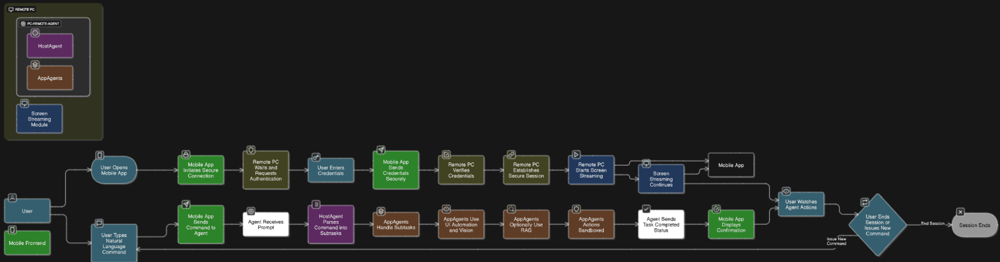
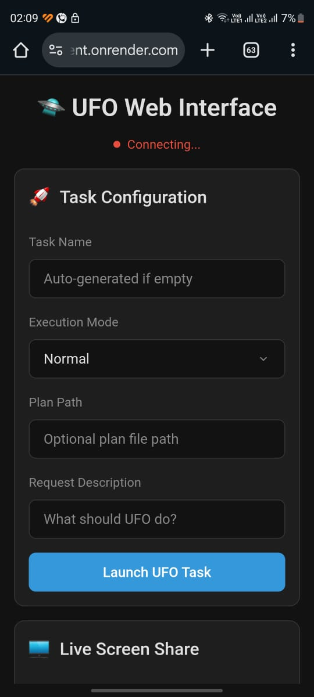
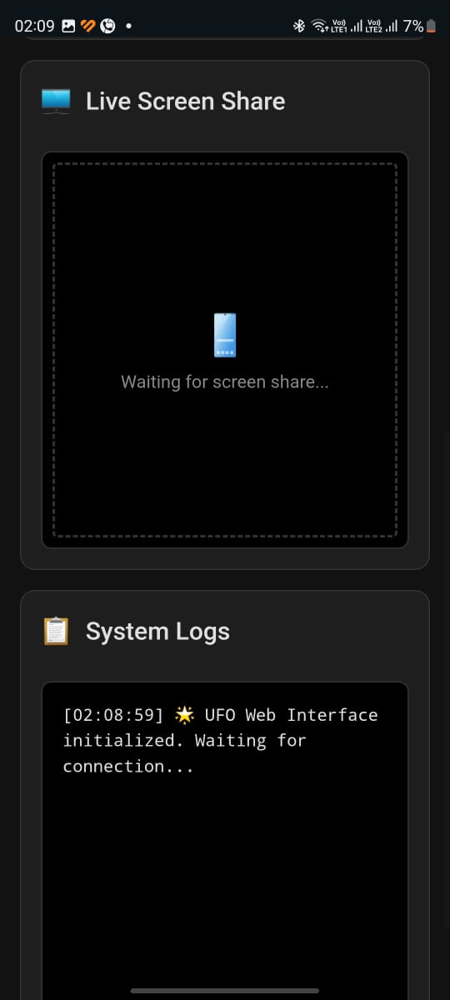

# PC-AGENT-REMOTE: Your AI Copilot for Remote PC Control

**Built for the [Launch IO Hackathon](https://io.net/hackathon#overview)**

---

## 🚀 What is PC-AGENT-REMOTE?

PC-AGENT-REMOTE is an advanced, real-world AI agent system that lets you control your Windows PC from any device using natural language. It’s built on top of Microsoft's agent framework and now integrates directly with the IO Intelligence API, making it a perfect fit for the hackathon’s “Autonomous Agents in the Real World” track.

---

## 🏆 Why It’s a Great Fit for the Hackathon

- **Uses IO Intelligence API**: All LLM calls are routed through the IO Intelligence API, as required by the hackathon.
- **Real-World Automation**: Lets users perform complex, multi-app tasks on their PC remotely, just by describing what they want.
- **Live Human-AI Interaction**: Users see the agent’s actions in real time via live screen streaming.
- **Extensible & Modular**: Built to be extended with new agent types, workflows, and integrations.

---

## 🧠 How It Works

1. **User connects via a web/mobile frontend** (beautiful, responsive UI).
2. **User sends a natural language request** (e.g., “Find the latest sales report and email it to my manager”).
3. **Request is routed to the backend Flask server**, which manages sessions and logs.
4. **PC-AGENT-REMOTE interprets and executes the task** using the IO Intelligence LLM API for reasoning and planning.
5. **Live screen sharing** lets the user watch the agent work in real time.
6. **System logs and task status** are streamed back to the frontend for transparency.

---

## ✨ Key Features (Expanded)

- **Prompt-Based Control:** No need for a virtual mouse—just describe your task in plain English.
- **Live Screen Streaming:** Watch your PC’s screen in real time from your phone or browser.
- **Multi-Agent Collaboration:** Host, App, Evaluation, and Backup agents coordinate to complete tasks.
- **Session Management:** Launch, monitor, and stop tasks with clear feedback and logs.
- **Modern, Mobile-First UI:** Designed for usability on both desktop and mobile devices.
- **Secure & Configurable:** API keys and endpoints are managed securely; supports multiple agent types and models.

---

## 🛠️ Key Technologies

- **IO Intelligence API**: All LLM calls use the required API (see `IOIntelligenceService` in `ufo/llm/`).
- **Flask + Flask-SocketIO**: Backend server for task management, logs, and real-time screen streaming.
- **Modern Web Frontend**: Responsive, mobile-friendly interface for launching and monitoring tasks.
- **PyAutoGUI**: For screen capture and automation.
- **Multi-Agent Architecture**: Host, App, Evaluation, and Backup agents, all configurable for IO Intelligence.

---

## 🔑 Example: IO Intelligence Integration

```python
from ufo.llm.base import BaseService

class IOIntelligenceService(BaseService):
    # ... (see your code above for full implementation)
    def chat_completion(self, messages, ...):
        url = f"{self.base_url}/chat/completions"
        headers = {"Authorization": f"Bearer {io_intelligence_api_key}"}
        # ... (rest of the logic)
```

Configuration (in your config):

```yaml
HOST_AGENT:
  API_TYPE: "iointelligence"
  API_BASE: "https://api.intelligence.io.solutions/api/v1"
  API_KEY: "<your-key>"
  API_MODEL: "meta-llama/Llama-4-Maverick-17B-128E-Instruct-FP8"
  # ... (other settings)
```

---

## 🏗️ Architecture Diagram

[View the interactive architecture diagram on Eraser](https://app.eraser.io/workspace/njSdk3itd9sXnLPBT7bd?origin=share)

> 

---

## 📸 Screenshots

### Mobile Web Interface (Task Configuration)


### Mobile Web Interface (Live Screen Share & Logs)


*Above: The mobile UI allows users to configure tasks, monitor live screen sharing, and view system logs in real time.*

---

## 🌐 Live Demo

- **Web UI**: Launch and monitor tasks, see live screen, and view logs.
- **Screen Sharing**: Real-time updates via Socket.IO.
- **API Endpoints**: `/api/launch`, `/api/status/<task_id>`, `/api/logs/<task_id>`, etc.

---

## 📝 Submission Checklist

- [x] **Uses IO Intelligence API** for all LLM/agent calls
- [x] **Working code** in this repo
- [x] **Demo video** (to be added)
- [x] **Documentation** (this README)
- [x] **Clear explanation** of how IO Intelligence is used

---

## 🙌 Acknowledgements

- Powered by [IO Intelligence](https://io.net/hackathon#overview)
- Created for the Launch IO Hackathon

---

## 📣 Notes for Judges

- All LLM calls are routed through IO Intelligence as required.
- The system is fully modular and can be extended for new agent types or workflows.
- The web UI and backend are designed for real-time, human-in-the-loop operation.

---

```
